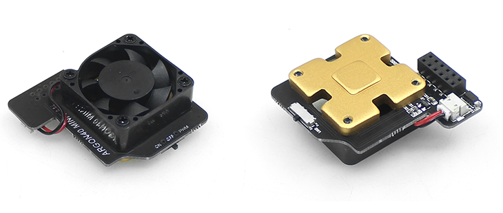

<p align="center">
 
 <h2 align="center">Raspi AutoFan</h2>
 <p align="center">Raspberry Pi PWM AutoFan Service for Python</p>
</p>

### 1.PWM Fan

You need to have a PWM fan for the Raspberry Pi.



### 2.Requirements

- Raspberry Pi OS (Original Raspbian System)
- PWM Fan

### 3.autofan.py

Using Python to control PWM fans.

```python
# -*- coding: utf-8 -*-
import RPi.GPIO as GPIO
import time

# Fan GPIO
FAN_GPIO = 18
# Low TEMP
MIN_TEMP = 48
# High TEMP
MAX_TEMP = 52
# How often to read CPU temperature in seconds
SAMPLING = 60

# Units in thousandths of a degree
def get_cpu_temp():
    with open('/sys/class/thermal/thermal_zone0/temp') as f:
        cpu_temp = int(f.read())
    return cpu_temp

def main():
    GPIO.setwarnings(False)
    GPIO.setmode(GPIO.BCM)
    GPIO.setup(FAN_GPIO, GPIO.OUT)
    GPIO.output(FAN_GPIO, GPIO.LOW) 
    time.sleep(5)
    try:
        while 1:
            temp = get_cpu_temp()
            print('CPU temperature:', temp)
            if temp < MIN_TEMP * 1000:
                GPIO.output(FAN_GPIO, 0)
            elif temp > MAX_TEMP * 1000:
                GPIO.output(FAN_GPIO, 1)
            else:
                GPIO.output(FAN_GPIO, 1)
            time.sleep(SAMPLING)
    except KeyboardInterrupt:
        pass
    GPIO.cleanup()

if __name__ == '__main__':
    main()
```

Save the above code as an `autofan.py` file, which can be placed in any location. For example, I put it under the `/pi/fan/autofan.py` path.

### 4.autofan.service

Then create a `autofan.service` and put it in `/etc/systemd/system` to start this python script automatically at boot.

```shell
[Unit]
Description=auto fan control
After=syslog.target
After=network.target

[Service]
RestartSec=2s
User=pi
Group=pi

# Your autofan.py location
WorkingDirectory=/home/pi/fan/
ExecStart=/usr/bin/python3 /home/pi/fan/autofan.py

[Install]
WantedBy=multi-user.target
```

Then refresh and load.

```shell
# Reload configuration  
sudo systemctl daemon-reload
# Boot up automatically
sudo systemctl enable autofan
```

You can still do the control manually.

```shell
# Start Service
sudo systemctl start autofan
# View Service Status
sudo systemctl status autofan
```
